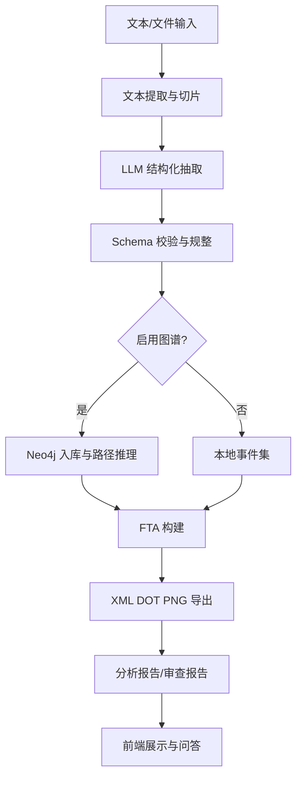
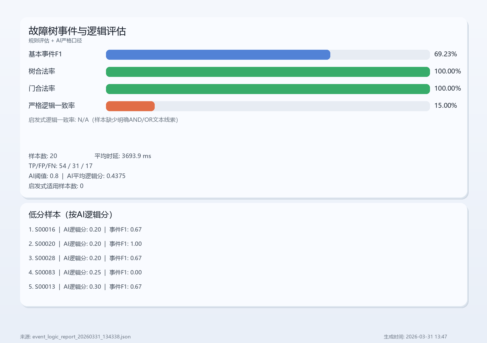

# 基于大语言模型和知识图谱的驱动系统故障树自动生成与可视化平台

> 文档状态：产品背景与演进设想。涉及“已落地”“当前指标”或上线能力的内容必须以当前源码、自动化门禁和带时间戳的报告为准；未在代码中实现的 LoRA、反馈回流和部署描述均属于后续方向。

## 1. 项目说明
### 1.1 项目背景
#### 1.1.1 项目行业背景
工业驱动系统（电机驱动、伺服系统、变频系统等）运行环境复杂，故障模式多样，传统依赖人工经验的故障分析方式难以满足高频维护与快速定位需求。随着智能制造推进，企业对“可追溯、可复用、可自动化”的故障诊断体系提出更高要求。

#### 1.1.2 项目客户背景
客户通常具备以下特点：
- 设备型号多、版本迭代快，维护资料分散。
- 现场故障处理依赖资深工程师，知识传承成本高。
- 需要形成标准化故障分析成果用于培训、审计、交付和运维。

#### 1.1.3 项目业务背景
当前业务流程中，故障树（FTA）构建需要人工从手册、告警记录、维修案例中提取信息并建模，周期长、质量波动大。项目旨在建设从文本到故障树的自动化平台，提升效率并降低专家依赖。

### 1.2 项目概述
本项目采用“LLM 抽取 + 知识图谱推理 + FTA 自动生成 + 可视化交互”技术框架，实现：
- 多源文本（手册、文档、上传文件）结构化抽取。
- 故障知识图谱建模、查询与关联推理。
- 故障树自动生成与多格式导出（XML、DOT、PNG、JSON、TXT）。
- 前端一体化展示、问答交互与报告审查。

### 1.3 项目意义
- 业务层面：显著缩短故障分析周期，提升定位准确性。
- 管理层面：沉淀可复用知识资产，降低人员流动风险。
- 工程层面：形成标准化输出，支持质量审查和持续优化。

### 1.4 价值分析
- 效率价值：从“小时级人工建树”向“分钟级自动生成”转变。
- 质量价值：统一抽取和建模规范，减少主观偏差。
- 资产价值：知识图谱和报告形成长期可复用数据资产。
- 交付价值：支持工程文档化与客户可视化验收。

### 1.5 项目创新点
#### 1.5.1 系统方案创新
（1）获得优质数据集
- 构建“手册文本 + 历史故障记录 + 专家修订”三源数据池。
- 建立抽取字段标准（fault_code、component、description、causes、parameters）和版本化管理。

（2）Web 页面交互设计
- 前端提供文本输入、文件上传、结果审查、图谱查询、问答辅助一体化交互。
- 支持 tree 与 dot_content 双视图联动，提升分析可解释性。

#### 1.5.2 模型创新
（1）获得优质数据集
- 构建领域标注集（故障码、原因、组件、参数、关系）用于监督评测和微调。
- 引入低置信样本回流机制，形成数据闭环。

（2）Web 页面交互设计
- 将专家审查行为（修改原因、调整门逻辑、补充事件）沉淀为模型优化样本。
- 通过前端审查结果驱动模型迭代（Prompt 优化 + LoRA 微调）。

#### 1.5.3 产品功能创新
（1）获得优质数据集
- 产品内置抽取结果导出与审查反馈回收，支持数据持续增量。

（2）Web 页面交互设计
- 支持“生成-审查-问答-修订”闭环流程，满足工程应用与管理决策双场景。

---

## 2. 问题分析与解决思路
### 2.1 需求调研
核心需求如下：
- 自动从复杂工业文本中提取故障要素并结构化。
- 支持因果关系可追溯与跨故障关联分析。
- 输出可直接用于评审和归档的标准化成果。
- 支持图谱可用与不可用两种运行场景。

### 2.2 项目目标
- 目标 1：自动抽取故障知识并生成高质量故障树。
- 目标 2：实现知识图谱增强推理与可解释查询。
- 目标 3：提供稳定 API 与可视化前端，支持工程化落地。
- 目标 4：建立模型迭代机制，持续提升抽取和建树质量。

### 2.3 解决思路
采用“分层 + 闭环”的方案：
1. 数据层：文本清洗、切片、标注、版本管理。
2. 模型层：LLM 抽取与报告生成，支持 Prompt Profile 和自定义指令。
3. 知识层：Neo4j 写入、路径推理、Cypher 查询。
4. 生成层：FTA 建树、逻辑门映射、导出与可视化。
5. 反馈层：审查反馈回流，驱动 Prompt 与 LoRA 持续优化。

---

## 3. 功能概述
### 3.1 功能需求
- 故障树生成：支持 ai/manual/text 三种输入源。
- 文件处理：支持单文件和多文件上传抽取。
- 图谱能力：支持图谱写入、查询与路径推理。
- 报告能力：自动生成 analysis_report 与 draft_review。
- 问答能力：结合向量检索、图谱检索、上下文树信息回答问题。

### 3.2 系统用例
1. 工程师输入顶事件和手册文本，自动生成故障树并导出图形。
2. 项目经理上传多个维修文档，系统合并分析形成统一故障树。
3. 专家对初稿进行审查，修订意见进入反馈闭环。
4. 现场人员通过智能问答快速查询可能原因和关联事件。

### 3.3 运行环境
- 后端：Python 3.10+、FastAPI、Uvicorn。
- 模型接口：OpenAI 兼容 API（Qwen/GPT 等）。
- 图数据库：Neo4j（可选增强，异常时自动降级）。
- 前端：Vue。
- 可视化：Graphviz（DOT->PNG）。

---

## 4. 技术路线及技术实现方案
### 4.1 技术路线
本项目技术路线围绕“工业故障文本 -> 结构化知识 -> 故障树生成 -> 可视化与审查闭环”展开，核心在于利用大语言模型进行领域信息抽取，并结合知识图谱推理提升因果链可解释性与结果可复用性。

在方法论上可借鉴其他 AI 项目“数据驱动建模 + 模型推理 + 端到端交付”的工程思路：先通过高质量数据与规则约束形成稳定抽取能力，再在后端完成推理与生成，最终将结构化结果回传前端实现可视化与交互。结合本项目场景，上述思路被具体落实为故障知识抽取、关系规整、逻辑门构建与标准化导出闭环。



### 4.2 技术实现方案
当前平台采用主流程与增强流程双链路：

1. 主流程（已落地）
- 接口层：FastAPI 提供健康检查、生成、审查、问答、图谱查询、上传生成。
- 生成层：/api/fta/generate 和 /api/fta/generate_agent。
- 文件层：/api/fta/generate_from_file 和 /api/fta/generate_from_files。
- 快速模式：/api/fta/full_generate 支持 hybrid/llm/deterministic。

自由文本抽取的当前内部链路为：

```text
原始文本 -> ModelClient -> TextExtractionAdapter -> ExtractionResult
                                  -> FaultRecord[]
                                  -> diagnostics / evidence_spans
```

其中 `ModelClient` 只负责模型调用，`TextExtractionAdapter` 负责分块、JSON
解析、字段校验、记录聚合和错误分级；`ExtractionResult` 是抽取阶段的统一
结果合同。旧的 `extract_fault_records_from_text` 仍作为兼容投影保留，新的
内部代码应优先消费结构化结果。

抽取记录与人工审核分离：每条 `FaultRecord` 初始可关联 `pending` 审核状态；
人工批准、否决或要求修改时新增不可变的 `FaultRecordReview`，不修改原始
抽取事实。`review_id` 标识一次审核动作，`record_id` 关联故障记录，审核
时间使用带时区的 UTC 时间；后续查询可根据同一记录的最新审核动作得到当前状态。

`ReviewPreparationService` 接收完整的 `ExtractionResult`：低置信度、缺少证据
或任务处于 `partial` 的记录生成 `pending` 审核实体；满足当前阈值且有证据的
记录标记为 `not_required`；`empty` 和 `failed` 不生成审核实体。
其组合入口返回 `ReviewableExtractionResult`，将抽取结果与当前审核状态放在
同一个编排对象中，但不修改原始抽取合同。

审核历史通过 `ReviewRepository` 保存和查询；默认应用组合根使用 SQLite 适配器，schema
版本当前为 2，
按 `record_id` 查询历史，并以审核时间和 SQLite 序号确定最新状态。内存实现仍保留
用于快速的合同和服务测试。
人工批准、否决或要求修改由 `ReviewDecisionService` 创建新的审核实体，
再交给仓储保存，不能直接覆盖旧审核记录。

完整的抽取任务由 `ExtractionRepository` 持久化，保存对象是整个
`ExtractionResult`，包括结果 ID、故障记录、证据和诊断信息，而不是只保存某一条
`FaultRecord`。默认 SQLite 仓储保存完整抽取结果，并以唯一的 `result_id` 拒绝覆盖；
内存仓储仍用于不依赖文件系统的单元测试。

`ExtractionApplicationService` 负责应用层编排：接收文本、调用 `FaultExtractor`、
生成初始审核状态，并通过 `ExtractionWorkflowRepository` 一次保存抽取结果和审核
记录。SQLite 实现先完成全部校验，再在同一个事务中提交两类数据，避免应用服务分别写
两个仓储；失败日志、失败任务和补偿机制属于后续专题。

API 层通过 `POST /api/fta/extract` 暴露这一审核优先的抽取用例；人工通过审核动作
接口新增不可变审核决定，`GET /api/fta/reviews/pending` 提供当前仓储中的故障记录级待审核列表，
`POST /api/fta/release` 再根据仓储中的最新审核状态生成下游安全投影。该接口链不直接
复用旧的 `full_generate`，因为后者仍负责多种解析、
Fallback、DOT 生成和前端渲染。

抽取结果不能直接进入后续 FTA 建树。`FaultRecordReleaseService` 是审核放行门：
它按 `record_id` 查询仓储中的当前审核状态，持久化的最新审核决定优先于抽取时的
审核快照。当前默认只有 `approved` 可以放行；`pending`、`revision`、`rejected`
和缺失审核状态都会被拦截。放行后生成不可变的 `ReleasedExtractionResult`，其中只
包含可供下游消费的故障记录，被拦截记录只保留编号、状态和原因，不携带可消费的
`FaultRecord` 数据。`not_required` 是否允许自动放行必须通过显式策略配置，不能
隐式混入人工批准结果。

放行快照会保存到 SQLite，后续建树只接收 `ReleasedExtractionResult`，不直接消费原始
`ExtractionResult`。`FaultTreeBuildService` 每次调用都会追加一条 `FaultTreeBuildAttempt`；
成功记录故障树，失败记录原因和是否可重试。建树失败不回滚审核决定或放行快照，重复尝试
继续追加新记录，以便保留完整排查与审计历程。对应接口为 `POST /api/fta/build_released`
和 `GET /api/fta/build_attempts/{release_id}`；本轮后端已提供合同和持久化，但前端暂不接入。

2. 增强流程（可演进）
- 数据闭环：低置信度样本与人工审查修订回流到训练集。
- 模型迭代：Prompt 优化 -> LoRA 微调 -> A/B 验证 -> 灰度上线。
- 工程治理：模型版本管理、回滚机制、回归评测门禁。

3. 稳定性策略
- 图谱降级：Neo4j 异常时回退本地事件建树。
- 输出兜底：兼容路径可在模型未抽到记录时使用规则兜底，但结果标记为
  `partial` 并要求人工复核；模型调用失败时不允许兜底掩盖失败。
- 可追踪：返回 stages、knowledge_graph 状态、中间文件路径。

### 4.3 效果评价准则
建议采用三层指标体系：

1. 模型指标
- 字段抽取准确率（Precision/Recall/F1）。
- 结构合法率（JSON/Schema 通过率）。
- 幻觉率（无依据字段占比）。

2. 工程指标
- 接口成功率、平均响应时延、失败重试率。
- 导出成功率（XML/DOT/PNG 生成成功比例）。

3. 业务指标
- 故障树生成时间缩短比例。
- 人工修订工时降低比例。
- 专家一致性评分（审查通过率）。

### 4.4 训练参数调优方案与评测效果展示
本系统可写入 LoRA 微调方案，建议作为“可选增强模块”。

1. 微调目标
- 提升领域文本抽取一致性，降低漏抽和错配。
- 改善因果关系和门逻辑建议质量。

2. 推荐方案
- 方案：QLoRA/LoRA。
- 训练任务：信息抽取（序列到结构化 JSON）。
- 训练数据：手册段落 + 标注答案 + 专家修订记录。

3. 参数建议（示例）

| 参数 | 建议范围 | 说明 |
|---|---:|---|
| LoRA rank (r) | 8-64 | 容量与泛化平衡 |
| LoRA alpha | 16-128 | 缩放系数 |
| LoRA dropout | 0.05-0.15 | 防过拟合 |
| learning rate | 1e-5 ~ 3e-4 | 需网格搜索 |
| batch size | 4-32 | 结合显存与梯度累计 |
| max sequence length | 2048-8192 | 结合文档长度分布 |
| warmup ratio | 0.03-0.1 | 稳定训练前期 |

4. 评测展示模板

| 模型方案 | 抽取F1 | 结构合法率 | 幻觉率 | FTA可生成率 | 专家评分 |
|---|---:|---:|---:|---:|---:|
| Base + Prompt | 待测 | 待测 | 待测 | 待测 | 待测 |
| Base + Prompt + RAG | 待测 | 待测 | 待测 | 待测 | 待测 |
| Base + LoRA + RAG | 待测 | 待测 | 待测 | 待测 | 待测 |

5. 上线建议
- 先离线评测，再小流量灰度。
- 指标未达阈值自动回滚到基线模型。

### 4.5 结果展示
平台输出结果包括：
- 结构化结果：tree、events、extracted_faults。
- 可视化结果：dot_content、PNG 图。
- 文档结果：analysis_report、draft_review 及对应 TXT/JSON。
- 文件结果：XML、DOT、PNG、分析与审查文件路径。

以下数值来自 2026-03-31 保存的历史报告，仅作为迁移后的基线材料；本次仓库整理没有重新运行在线模型、Neo4j 或 API 模式评测，因此不能视为当前提交的质量结论：
- 通用评估（API 模式，test 集）：
  - 结构合法率：100.00%
  - 幻觉率：0.31%
  - FTA 生产率：100.00%
  - 平均时延：3661.6 ms
- 事件与逻辑专项评估（API + AI 严格口径，阈值 0.8）：
  - 基本事件 F1：69.23%
  - 树合法率：100.00%
  - 门合法率：100.00%
  - 启发式逻辑一致率：N/A（当前样本缺少明确 AND/OR 文本线索）
  - 严格逻辑一致率：15.00%
  - AI 平均逻辑分：0.4375
  - 平均时延：3693.9 ms

对应历史成果文件：
- [通用评测报告](../evaluation/quality_eval/runs/metric_report_20260331_122935.json)
- [事件逻辑评测报告](../evaluation/quality_eval/runs/event_logic_report_20260331_134338.json)
- [通用评测可视化](../evaluation/quality_eval/runs/metric_report_20260331_122935_chart_refined.png)
- [事件逻辑可视化](../evaluation/quality_eval/runs/event_logic_report_20260331_134338_chart.png)

图 1 事件与逻辑评估图（历史指标）：



### 4.6 智能交互平台搭建
- 对外接口：REST API（FastAPI）。
- 前后端通信：HTTP/JSON。
- 交互能力：生成、审查、问答、图谱查询、上传处理。
- 可扩展能力：模型切换、提示词模板切换、图谱规则扩展。

### 4.7 应用对象和开发环境
应用对象：
- 设备运维工程师。
- 故障分析专家。
- 项目交付与质量管理人员。

开发环境：
- Windows/Linux 均可。
- Python 虚拟环境（Conda/venv）。
- Neo4j、Graphviz（按需）。

### 4.8 界面设计与功能简介
- 首页：系统信息输入、顶事件输入、模式选择。
- 结果页：树结构展示、DOT 图展示、报告分区展示。
- 问答页：结合知识库和图谱上下文进行智能问答。
- 运维页：显示接口状态、模型配置、导出文件管理。

---

## 5. 测试计划
### 5.1 测试方法
- 单元测试：核心函数（抽取、建树、导出、清洗）。
- 接口测试：请求参数校验、异常分支、返回结构一致性。
- 集成测试：模型、图谱、导出工具链联调。
- 回归测试：固定样本集全链路回归。

### 5.2 系统所用技术工具说明书
- 开发框架：FastAPI、Pydantic、Vue。
- 抽取审核持久化：SQLite；知识图谱：Neo4j（可选）。
- 可视化：Graphviz。
- 评测工具：自定义评测脚本 + 标注对比工具。
- 日志工具：应用日志 + 阶段状态日志。

### 5.3 测试计划
1. 第一阶段：功能正确性测试（接口、导出、问答）。
2. 第二阶段：稳定性测试（高并发、长文本、失败重试）。
3. 第三阶段：质量测试（专家盲评、抽取准确率评测）。
4. 第四阶段：上线验证（灰度发布、回滚演练）。

历史测试结论（阶段性，不代表当前上线门槛）：
- 2026-03-31 的报告记录了树合法率、门合法率和 FTA 生产率均为 100%。
- 同一次历史评测显示抽取语义质量和逻辑语义一致性仍有提升空间（基本事件 F1 69.23%，严格逻辑一致率 15.00%）。
- 下一阶段重点：
  1) 扩充金标数据集并补齐 evidence_spans；
  2) 针对低分样本做 Prompt/规则优化与 LoRA 微调；
  3) 重新执行统一基线并用版本化报告跟踪迭代收益。

---

## 6. 项目成员框架与质量保证
### 6.1 组织成员
- 项目负责人。
- 算法工程师。
- 后端工程师。
- 前端工程师。
- 测试工程师。
- 领域专家/顾问。

### 6.2 角色与职责安排
- 项目负责人：里程碑、资源协调、风险管理。
- 算法工程师：Prompt 设计、LoRA 微调、评测体系。
- 后端工程师：API、工作流、导出链路、稳定性。
- 前端工程师：可视化交互、结果展示、审查闭环。
- 测试工程师：测试方案、自动化测试、质量门禁。
- 领域专家：标注规则、审查标准、验收评估。

### 6.3 项目评审
- 周评审：进度、问题、风险。
- 里程碑评审：需求冻结、功能验收、上线评审。
- 模型评审：评测指标达标后方可上线。

### 6.4 交付物说明
- 系统源码与部署文档。
- API 文档与前端使用手册。
- 测试报告、评测报告、风险清单。
- 样例故障树成果（XML、DOT、PNG、报告）。

---

## 7. 商业计划
### 7.1 市场机遇
工业数字化升级推动智能运维需求增长，客户对“可解释、可审计、可持续迭代”的故障分析平台需求显著提升。

### 7.2 市场需求
- 降低故障处理成本和停机损失。
- 缩短新工程师成长周期。
- 提供标准化交付成果满足审计与合规。
- 支持私有化部署和行业定制。

### 7.3 竞争分析
相较于纯规则系统或通用问答系统，本项目优势在于：
- 全流程闭环：从抽取、推理到建树和报告输出。
- 工程可用：提供标准格式导出和可视化展示。
- 可持续优化：支持 Prompt 与 LoRA 双路线迭代。
- 可落地部署：支持私有化、可按客户场景定制。

---

## 附录 A：当前接口清单（用于实施对照）
- GET /api/health
- POST /api/fta/build_dot
- POST /api/fta/full_generate
- POST /api/fta/generate
- POST /api/fta/review
- POST /api/fta/generate_agent
- POST /api/fta/generate_from_file
- POST /api/fta/generate_from_files
- POST /api/kg/query
- POST /api/chat

## 附录 B：建议里程碑
1. M1（2-3 周）：需求冻结、基础接口联通、前端原型可用。
2. M2（3-4 周）：主流程上线（文本抽取、建树、导出、报告）。
3. M3（2-3 周）：图谱增强、问答能力、稳定性优化。
4. M4（2-4 周）：LoRA 训练与评测、灰度发布、验收交付。
